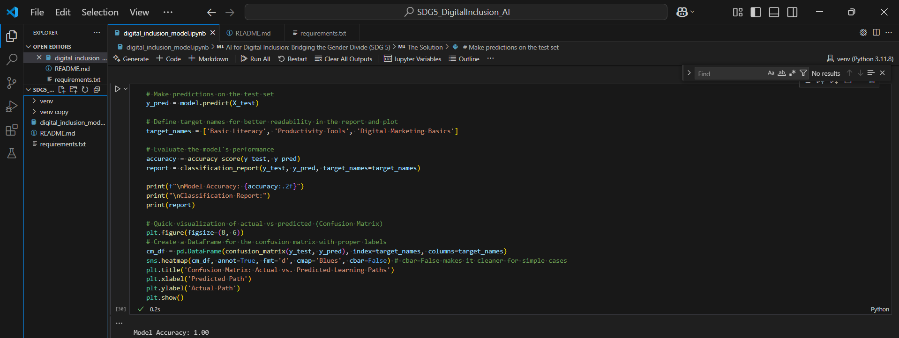

# SDG 5: AI for Digital Inclusion - Bridging the Digital Gender Divide

## Project Description
This project explores the application of Artificial Intelligence, specifically machine learning, to address **UN Sustainable Development Goal 5: Gender Equality**. Our focus is on promoting digital inclusion for women in remote areas by developing an AI-powered adaptive learning system for digital skills training.

## The Problem
The digital gender divide severely impacts women in underserved regions, limiting their access to vital digital skills, which are crucial for economic empowerment, education, and access to information. Traditional training methods often fall short in catering to diverse learning needs and resource constraints in these areas.

## The Solution: AI-Powered Adaptive Learning
This project proposes an AI-driven solution that aims to personalize digital skills education. By leveraging supervised machine learning, the system can recommend tailored learning paths, content, and pacing based on an individual's initial skill level, learning preferences, and available resources. Conceptually, Natural Language Processing (NLP) can enhance this by providing accessible content (e.g., simplified explanations, multilingual support) and an AI-powered chatbot for instant, on-demand learner support.

## Machine Learning Approach (Implemented in this Demo)
We've implemented a **Supervised Learning** model to simulate the recommendation of personalized learning paths. Based on simulated learner data (initial literacy, smartphone access, internet connectivity, learning preference, age group), the model predicts the most suitable digital skills training module (e.g., Basic Literacy, Productivity Tools, Digital Marketing Basics).

## Ethical Considerations
We recognize the critical importance of ethical AI. This project reflects on potential biases in data (e.g., sampling bias, historical bias) and outlines strategies for mitigation, such as ensuring diverse data collection and using interpretable models. Our solution is designed to promote fairness by providing equitable and personalized learning opportunities, and sustainability by considering accessibility in resource-constrained environments.

## How to Run This Project
1.  **Clone the repository:** `git clone [YOUR_REPO_URL]` (Replace with your actual GitHub URL later)
2.  **Navigate to the project folder:** `cd SDG5_DigitalInclusion_AI`
3.  **Create and activate a virtual environment:**
    * `python -m venv venv`
    * `source venv/bin/activate` (macOS/Linux) or `.\venv\Scripts\Activate.ps1` (Windows PowerShell)
4.  **Install dependencies:** `pip install -r requirements.txt`
5.  **Open the Jupyter Notebook:** `jupyter notebook digital_inclusion_model.ipynb` or open it directly in VS Code.
6.  **Run all cells** in the notebook to see the data simulation, model training, and evaluation.

## Deliverables Status (as of initial setup)
* [X] Code: `digital_inclusion_model.ipynb` (Contains data simulation, model training, evaluation, and initial ethical reflection)
* [ ] Report: A 1-page summary (Content from this README and the notebook's markdown cells will form the basis)
* [ ] Presentation: A 5-minute demo (Will build on the notebook's output and explanations)

## Inspiration
"AI can be the bridge between innovation and sustainability." — UN Tech Envoy
## Project Demo / Key Outputs

Below are some key outputs from running the `digital_inclusion_model.ipynb` notebook.

### Libraries Successfully Loaded

### Simulated Data Overview

### Model Performance Report

### Learning Path Prediction (Confusion Matrix)

